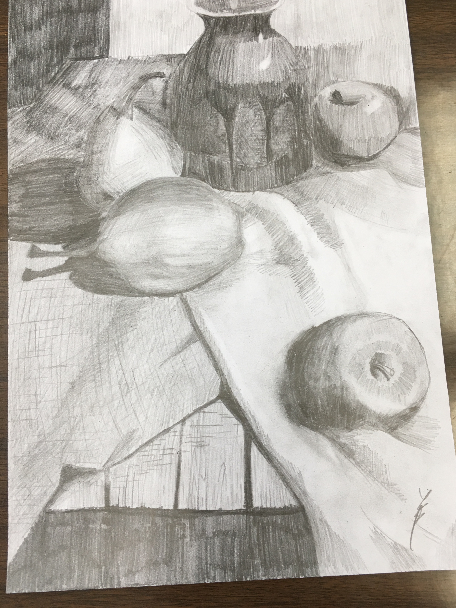
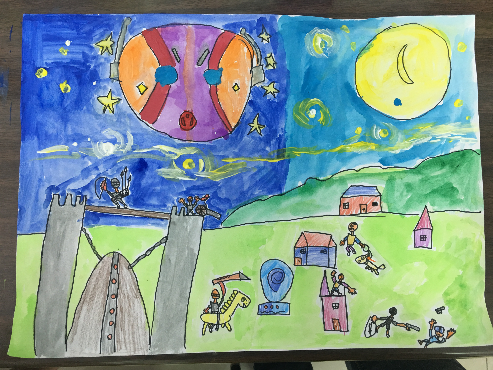
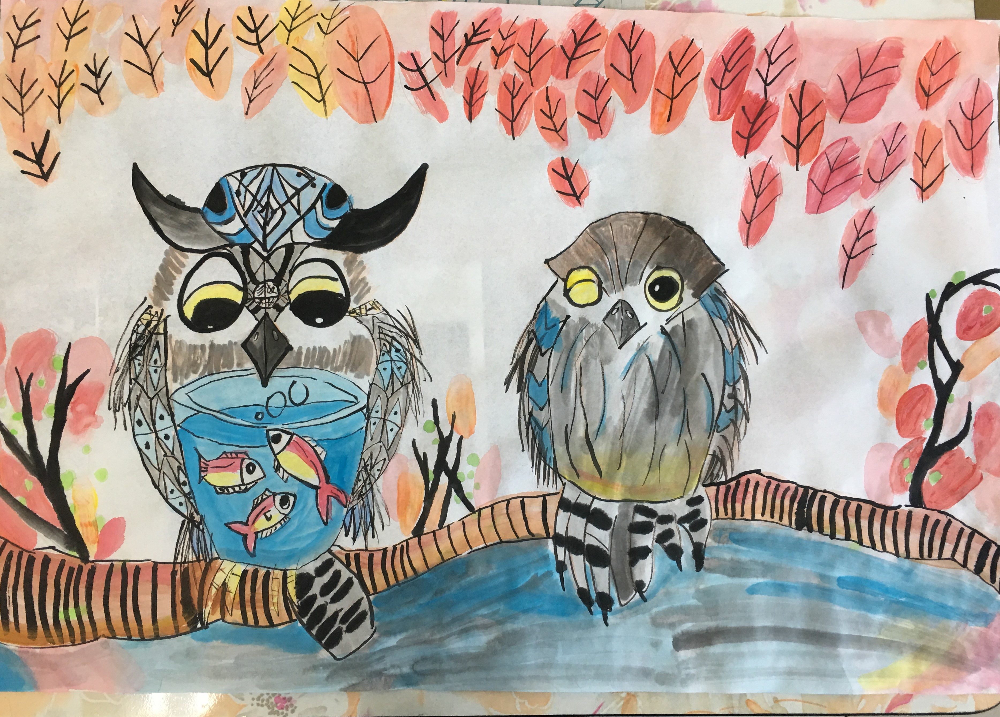
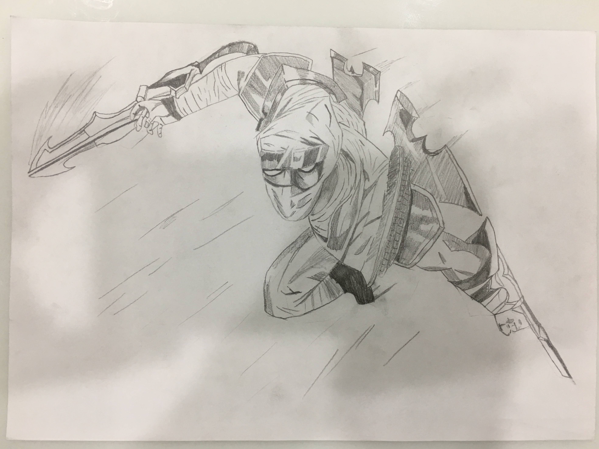
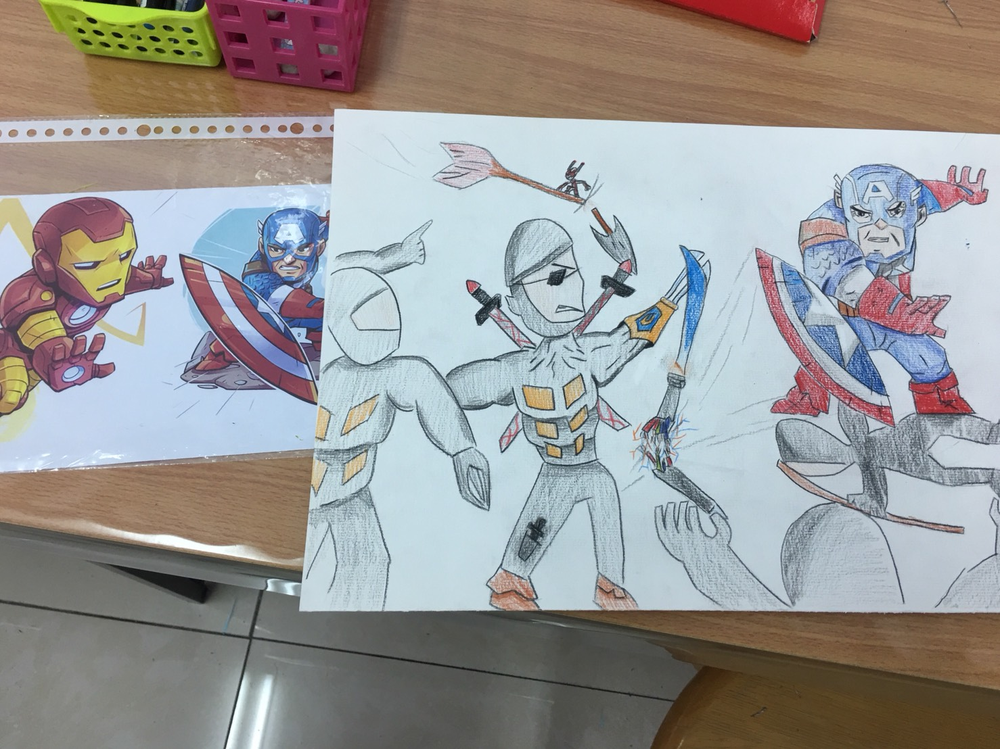
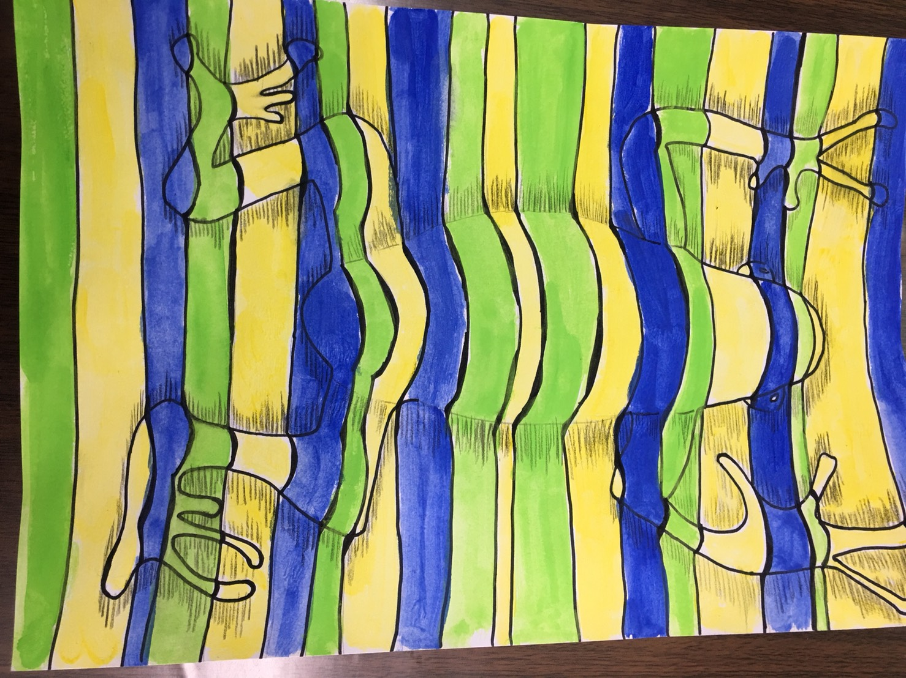
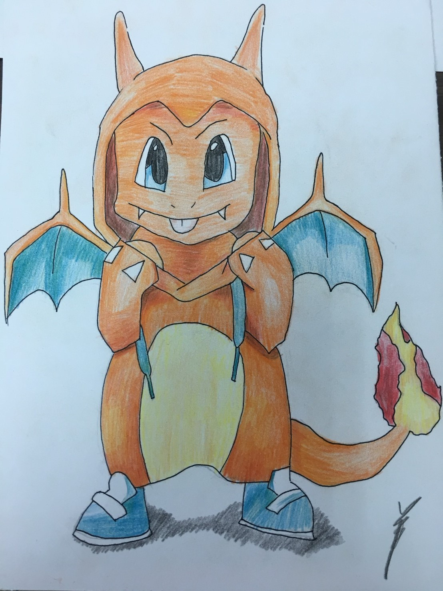

我家的藝廊

<a href="#睿-無尾熊">睿-無尾熊</a> <a href="#睿-夜晚">睿-夜晚</a> <a href="#睿-蟻人">睿-蟻人</a> <a href="#華-水果素描">華-水果素描</a> <a href="#華-貓頭鷹">華-貓頭鷹</a> <a href="#華-死侍">華-死侍</a> <a href="#華-美國隊長">華-美國隊長</a> <a href="#華-青蛙">華-青蛙</a> <a href="#華-噴火龍">華-噴火龍</a> 

***

### <a name="睿-無尾熊">睿-無尾熊</a>

色彩鮮艷,很活潑跟他的個性很像，雖然畫這圖的時候他的心情不美麗

### <a name="華-水果素描">華-水果素描</a>

這張畫的很棒 ! 很像

### <a name="睿-夜晚">睿-夜晚</a>

### <a name="華-貓頭鷹">華-貓頭鷹</a>

<a name="華-死侍">華-死侍</a>

 

<a name="華-美國隊長">華-美國隊長</a>

<a name="華-青蛙">華-青蛙</a>

<a name="華-噴火龍">華-噴火龍</a>

<a name="睿-蟻人">睿-蟻人</a>

