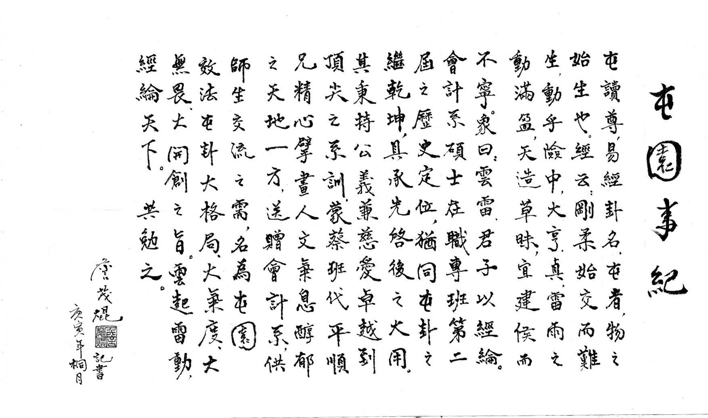
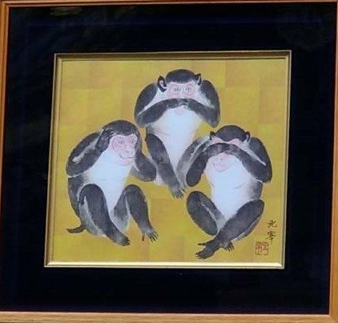

本質思考

***

顏淵問仁。子曰：「克己復禮為仁。一日克己復禮，天下歸仁焉。為仁由己，而由人乎哉？」
顏淵曰：「請問其目。」
子曰：「非禮勿視，非禮勿聽，非禮勿言，非禮勿動。」顏淵曰：「回雖不敏，請事斯語矣。」

> 何謂仁 ? 何謂禮 ? 
> 跳脫表象文字後如果解讀 
> 仁的本質是什麼， 種子那他就會產生質變也會有形變
> 禮(理)是一種自然律
> 勿視、勿聽、勿言、勿動。不要用五官感受，一層層往下剝；找到跟本才能找到對的方法解決問題。

